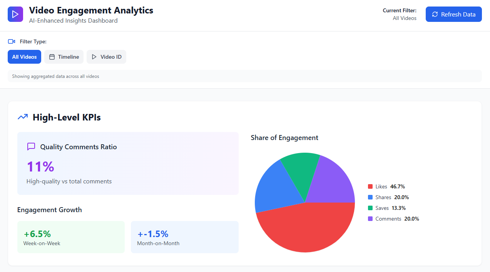
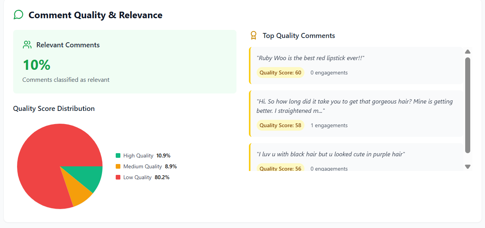
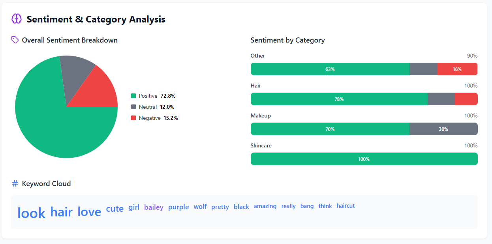
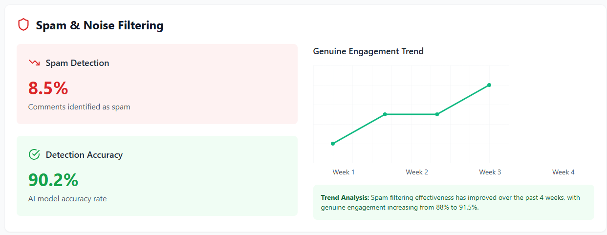
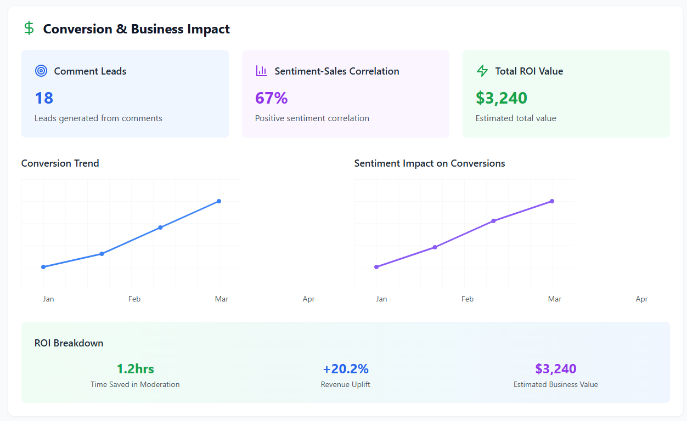

# CommentSense: AI-Powered Video Engagement Analysis

<br>

# Installation
1. Clone the repository to local machine:
```
https://github.com/dingxing03/CommentSense
```

2. Install the 'requirements.txt' for backend:
```
pip install -r requirements.txt
```

3. Open the website (frontend):
```
npm install
npm run dev
Open the localhost at: http://localhost:5173/
```


## 📌 Introduction  
Businesses often measure engagement through **likes, shares, and comments (SoE)**. However, these metrics don’t reveal whether feedback is relevant, meaningful, or positive/negative in sentiment.  
**CommentSense** addresses this by analyzing the **quality, relevance, and sentiment** of comments at scale, while filtering out spam and noise to uncover true customer insights.  

---

## 🚩 Problem Statement  
- How can we measure the **ratio of quality comments**?  
- How do we determine the **relevance and sentiment** of comments?  
- Can comments be filtered out by **categorization**?  
- How do we detect and filter **spam comments**?  

---

## 💡 Our Solution  
We designed an **end-to-end pipeline** consisting of five main modules:  
1. **Translation Module** – Handles multilingual and mixed-language comments.  
2. **Spam Detection Module** – Identifies and removes noise or irrelevant text.  
3. **Categorization Module** – Groups comments into product categories like skincare and makeup.  
4. **Sentiment Analysis Module** – Detects emotions and overall sentiment such as positive, negative, or neutral.  
5. **Comment Quality Module** – Scores comments based on relevance, sentiment, and engagement.  

---

## 🛠 Development Tools  
- **Translation**: `langdetect` + `deep-translator`  
- **Spam Detection**: `madhurjindal/autonlp-Gibberish-Detector-492513457` (pre-trained model from Hugging Face)  
- **Categorization**: `facebook/bart-large-mnli` (Zero-Shot Classification)  
- **Sentiment Analysis**: DistilBERT + Graph Neural Network Refiner (GoEmotions dataset)  
- **Environment**: Python, Jupyter, Hugging Face Transformers  

---

## 🔎 Methodology  

### 1. Translation 
- Translate multilingual comments to English with context-aware translation.  

### 2. Text Preprocessing
- Standardize text: lowercasing, expanding contractions and short forms, cleaning, tokenizing, lemmatizing, and removing stopwords.  

### 3. Spam Detection  
- Implemented a pre-trained Hugging Face model.  
- “Noise” classified as spam and removed.  

### 4. Categorization  
- Zero-shot classification groups comments into relevant product categories.  

### 5. Sentiment Analysis  
- **DistilBERT + GNN Refiner**  
  - Captures semantic meaning and emotion co-occurrence.  
  - Trained on the **GoEmotions dataset** (27 fine-grained emotions + neutral).  
  - Strong performance on short forms, slang, and informal text.  
- Emotions are mapped into **positive, negative, neutral** sentiments.  

### 6. Comment Quality Scoring  
- Weighted score: **0.5 × Relevance + 0.3 × Sentiment + 0.2 × Engagement**  
- Normalized to [0–1] scale.  
- Spam comments automatically assigned a score of 0.  

---

## 🖥 Prototype  
- Interactive **dashboard** for:  
  - Engagement quality insights  
  - Campaign ROI tracking  
  - Category-level sentiment analysis  
  - Early detection of negative buzz  
- **Filtering by Video ID & Time Period**: Users can select a specific video or time period to view detailed comment analysis.  

<p align="center">
  
</p>
**Figure 1:** Homepage of Dashboard displaying Quality Comments Ratio  

<p align="center">
  
</p>
**Figure 2:** Homepage of Dashboard displaying Relevant Comment Score & Top Quality Comments  

<p align="center">
  
</p>
**Figure 3:** Homepage of Dashboard displaying Sentiment & Category Analysis  

<p align="center">
  
</p>
**Figure 4:** Homepage of Dashboard displaying Spam Filter  

<p align="center">
  
</p>
**Figure 5:** Homepage of Dashboard displaying Impact and ROI  

---

## ⚠️ Limitations  
- Limited computational power restricted advanced transformer models.  
- Budget constraints prevented use of certain APIs.  
- Limited annotated datasets affected model optimization.  

---

## 🚀 Future Enhancements  
- Use **pre-trained translation models** for higher accuracy.  
- Increase dataset annotations to improve model performance.  
- Add **real-time alerts** for spikes in negative sentiment.  

---

## 👥 Stakeholders & Impact  
- **Marketing**: Identify resonating campaigns and products.  
- **PR**: Track brand sentiment and manage crises early.  
- **Product Development**: Capture customer feedback for product improvements.  
- **Sales & Support**: Detect purchase intent, upsell opportunities, and complaints.  

**Impact:**  
- Move beyond vanity metrics to **true engagement quality**.  
- Enable **faster, smarter decisions** with real-time insights.  
- Enhance customer experience and revenue opportunities.  

---

## 📢 Team HiFive  
Prepared by:  
- Amanda Grace Seow  
- Ding Yuan Xing  
